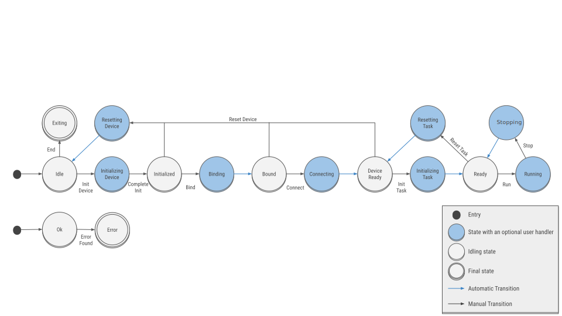

# FairMQ Documentation

Click the  icon in the top left corner to view the table of contents!

## Installation

Compile from source with a standard CMake worflow (`<source-dir>`, `<build-dir>`, `<install-dir>` are directories of
your choice, **must be different**):

```bash
git clone https://github.com/FairRootGroup/FairMQ <source-dir>
cmake -S <source-dir> -B <build-dir> -GNinja -DCMAKE_BUILD_TYPE=Release -DCMAKE_INSTALL_PREFIX=<install-dir>
cmake --build <build-dir> --target install
```

Consult the [manpages of your CMake version](https://cmake.org/cmake/help/latest/manual/cmake.1.html) for more options.

If dependencies are not installed in standard system directories, you can hint the installation location via
`-DCMAKE_PREFIX_PATH=...` or per dependency via `-D{DEPENDENCY}_ROOT=...` (`*_ROOT` variables can also be environment
variables).

### Dependencies

| **Dependency** | **Required** | **Bundled?** |
| --- | --- | --- |
| [Boost](https://www.boost.org/) | :heavy_check_mark: | :x: |
| C++17 compiler: e.g. [GCC](https://gcc.gnu.org/) or [Clang](https://clang.llvm.org/) | :heavy_check_mark: | :x: |
| [CMake](https://cmake.org/) | :heavy_check_mark: | :x: |
| [FairLogger](https://github.com/FairRootGroup/FairLogger) | :heavy_check_mark: | :x: |
| [ZeroMQ](http://zeromq.org/) | :heavy_check_mark: | :x: |
| [FairCMakeModules](https://github.com/FairRootGroup/FairCMakeModules) | :heavy_check_mark: | :heavy_check_mark: if not found via `find_package` |
| [GTest](https://github.com/google/googletest) | when `-DBUILD_TESTING=ON` | :heavy_check_mark: skip with `-DUSE_EXTERNAL_GTEST=ON` |
| [asio](https://github.com/chriskohlhoff/asio) | when `-DBUILD_OFI_TRANSPORT=ON` | :x: |
| [asiofi](https://github.com/FairRootGroup/asiofi) | when `-DBUILD_OFI_TRANSPORT=ON` | :x: |
| [Doxygen](http://www.doxygen.org/) | when `-DBUILD_DOCS=ON` | :x: |
| [PMIx](https://pmix.org/) | when `-DBUILD_PMIX_PLUGIN=ON` | :x: |

## Usage

FairMQ installs itself as a CMake package, so in your `CMakeLists.txt` you can discover it like this:

```cmake
find_package(FairCMakeModules 1.0 REQUIRED)
include(FairFindPackage2)
find_package2(PRIVATE FairMQ)
find_package2_implicit_dependencies()
```

The [`FairFindPackage2` module](https://fairrootgroup.github.io/FairCMakeModules/latest/module/FairFindPackage2.html)
is part of the [`FairCMakeModules` package](https://fairrootgroup.github.io/FairCMakeModules).

If FairMQ is not installed in system directories, you can hint the installation:

```cmake
list(PREPEND CMAKE_PREFIX_PATH <install-dir>)
```

Optionally, you can require certain FairMQ package components and a minimum version:

```cmake
find_package2(PRIVATE FairMQ VERSION 1.4.50 COMPONENTS ofi_transport)
```

When configuring FairMQ, CMake will print a summary table of all available package components.

Now, link your executable/library against FairMQ:

```cmake
add_executable(myprogram myprogram.cpp)
target_link_libraries(myprogram PRIVATE FairMQ::FairMQ)
```

### CMake package

After the `find_package(FairMQ)` call the following CMake variables are defined:

| **CMake variable** | **Info** |
| --- | --- |
| `${FairMQ_PACKAGE_DEPENDENCIES}` | the list of public package dependencies |
| `${FairMQ_<dep>_VERSION}` | the minimum `<dep>` version FairMQ requires |
| `${FairMQ_<dep>_COMPONENTS}` | the list of `<dep>` components FairMQ depends on |
| `${FairMQ_PACKAGE_COMPONENTS}` | the list of components FairMQ consists of |
| `${FairMQ_#COMPONENT#_FOUND}` | `TRUE` if this component was built |
| `${FairMQ_VERSION}` | the version in format `MAJOR.MINOR.PATCH` |
| `${FairMQ_GIT_VERSION}` | the version in the format returned by `git describe --tags --dirty --match "v*"` |
| `${FairMQ_PREFIX}` | the actual installation prefix |
| `${FairMQ_BINDIR}` | the installation bin directory |
| `${FairMQ_INCDIR}` | the installation include directory |
| `${FairMQ_LIBDIR}` | the installation lib directory |
| `${FairMQ_DATADIR}` | the installation data directory (`../share/fairmq`) |
| `${FairMQ_CMAKEMODDIR}` | the installation directory of shipped CMake find modules |
| `${FairMQ_BUILD_TYPE}` | the value of `CMAKE_BUILD_TYPE` at build-time |
| `${FairMQ_CXX_FLAGS}` | the values of `CMAKE_CXX_FLAGS` and `CMAKE_CXX_FLAGS_${CMAKE_BUILD_TYPE}` at build-time |

## Library concepts

The core library feature of FairMQ is the **asynchronous message passing abstraction** which is heavily inspired by
[ZeroMQ](http://zeromq.org/). [Message](#message)s are sent and received between [Channel](#channel)s adhering to a
certain scalability protocol defined as the Channel type. Furthermore, multiple data transport implementations exist
to provide high throughput and zero-copy efficiency for different scenarios.

### Transport matrix

| **Node** | **Process** | **Address format** | `zeromq` | `shmem` | `ofi` |
| --- | --- | --- | --- | --- | --- |
| intra | intra | `inproc://endpoint` | :heavy_check_mark::heavy_check_mark: | `n/a` | `n/a` |
| intra | inter | `ipc://endpoint` | :heavy_check_mark: | :heavy_check_mark::heavy_check_mark: | :x: |
| intra | inter | `tcp://host:port` | :heavy_check_mark: | :heavy_check_mark::heavy_check_mark: | :heavy_check_mark: |
| inter | inter | `tcp://host:port` | :heavy_check_mark:\* | `n/a` | :heavy_check_mark:\*\* |
| inter | inter | `verbs://host:port` | :x: | `n/a` | :heavy_check_mark::heavy_check_mark: |

* :heavy_check_mark: supported with limited bandwidth
* :heavy_check_mark::heavy_check_mark: supported with full bandwidth
* :x: no support planned
* `*` no bandwidth limit on Ethernet
* `**` development driver only, not intended for production use
* `n/a` not available (combination not meaningful)

#### `zeromq`

As the abstract transport interface is heavily inspired by ZeroMQ, the `zeromq` transport implementation is basically a
thin wrapper around the ZeroMQ API. It is well-suited for using classic posix socket and kernel-based TCP communication.

#### `shmem`

The `shmem` transport implements a control band via ZeroMQ and a data band via [Boost.Interprocess](https://www.boost.org/doc/libs/1_78_0/doc/html/interprocess.html).
Message buffers are placed into shmem segments which are mapped into each communicating process within a node.
An expensive memcopy across process boundaries is avoided which is especially useful, when the memory capacity of a node
does not allow multiple copies of large messages.

#### `ofi`

The `ofi` transport implements its control and data bands via the [`asiofi` C++ bindings](https://github.com/FairRootGroup/asiofi)
to the [OpenFabrics interfaces library `libfabric`](https://github.com/ofiwg/libfabric). By using the `FI_VERBS` provider
this transport can achieve full line rate on high bandwidth Infiniband fabrics by exploiting Remote Direct Memory Access
(RDMA) technology.

### Scalability protocols

| **scalability protocol** | `zeromq` | `shmem` | `ofi` |
| --- | --- | --- | --- |
| **PAIR** (bidirectional, blocking, one-to-one communication) | :heavy_check_mark: | :heavy_check_mark: | :heavy_check_mark: |
| **PUSH/PULL** (unidirectional, blocking, one-to-many communication with round-robin routing) | :heavy_check_mark: | :heavy_check_mark: | :x: |
| **REQ/REP** (bidirectional, blocking, many-to-one communication with source routing) | :heavy_check_mark: | `n/a` | :x: |
| **PUB/SUB** (unidirectional, non-blocking, broadcasting, one-to-many communication) | :heavy_check_mark: | :heavy_check_mark: | :x: |

* :heavy_check_mark: supported
* :x: no support planned
* `n/a` not available (combination not meaningful)

### Transport factory

A given transport implementation is instantiated by its corresponding polymorphic `fair::mq::TransportFactory`.
```cpp
static std::shared_ptr<fair::mq::TransportFactory> fair::mq::TransportFactory::CreateTransportFactory(const std::string& type);
```
`type` is either `"zeromq"`, `"shmem"`, or `"ofi"`. Multiple transports can be instantiated side-by-side. The transport
instance has to be kept alive during the use of the given transport. With the transport instance one can
create channels and messages as described in the following sections.

### Message

Channels transport data between each other in form of `fair::mq::Message`s. These can be filled with arbitrary content.
Message can be initialized in three different ways by calling `NewMessage()`:

```cpp
fair::mq::MessagePtr NewMessage() const;
```
**with no parameters**: Initializes an empty message (typically used for receiving).

```cpp
fair::mq::MessagePtr NewMessage(const size_t size) const;
```
**given message size**: Initializes message body with a given size. Fill the created contents via buffer pointer.

```cpp
using fair::mq::FreeFn = void(void* data, void* hint);
fair::mq::MessagePtr NewMessage(void* data, const size_t size, FreeFn* ffn, void* hint = nullptr) const;
```
**given existing buffer and a size**: Initialize the message from an existing buffer. In case of ZeroMQ this is a
zero-copy operation.

Additionally, FairMQ provides two more message factories for convenience:
```cpp
template<typename T>
fair::mq::MessagePtr NewSimpleMessage(const T& data) const
```
**copy and own**: Copy the `data` argument into the returned message and take ownership (free memory after message is sent).
This interface is useful for small, [trivially copyable](http://en.cppreference.com/w/cpp/concept/TriviallyCopyable) data.

```cpp
template<typename T>
fair::mq::MessagePtr NewStaticMessage(const T& data) const
```
**point to existing memory**: The returned message will point to the `data` argument, but not take ownership (someone else
must destruct this variable). Make sure that `data` lives long enough to be successfully sent. This interface is most
useful for third party managed, contiguous memory (Be aware of shallow types with internal pointer references! These will
not be sent.)

#### Ownership

The component of a program, that is reponsible for the allocation or destruction of data in memory, is taking ownership
over this data. Ownership may be passed along to another component. It is also possible that multiple components share
ownership of data. In this case, some strategy must be in place to determine the last user of the data and assign her the
responsibility of destruction.

After queuing a message for sending in FairMQ, the transport takes ownership over the message body and will free it with
`free()` after it is no longer used. A callback can be passed to the message object, to be called instead of the
destruction with `free()` (for initialization via buffer+size).

```cpp
static void fair::mq::NoCleanup(void* /*data*/, void* /*obj*/) {}

template<typename T>
static void fair::mq::SimpleMsgCleanup(void* /*data*/, void* obj) { delete static_cast<T*>(obj); }
```
For convenience, two common deleter callbacks are already defined in the `fair::mq::TransportFactory` class to aid the user
in controlling ownership of the data.

### Channel

A `fair::mq::Channel` represents a communication endpoint in FairMQ. Usage is similar to a traditional Unix network socket.
Channels are organized by a channel name and a subchannel index. All subchannels with a common channel name need to be of
the same transport type.

A channel either **binds** or **connects** which is determined by its **method**.

TODO details

### Poller

A poller allows to wait on multiple channels either to receive or send a message.

```cpp
fair::mq::PollerPtr NewPoller(const std::vector<const fair::mq::Channel*>& channels)
```
**list channels**: This poller waits on all supplied channels. Currently, it is limited to channels of the same transport
type only.

### Unmanaged region

The `fair::mq::UnmanagedRegion` APIs enable the user to implement her own memory management.

TODO details

## Framework concepts

### Device

The components encapsulating the tasks are called **devices** and derive from the common base class `FairMQDevice`. FairMQ provides ready to use devices to organize the dataflow between the components (without touching the contents of a message), providing functionality like merging and splitting of the data stream (see subdirectory `devices`).

### Topology

Devices are arranged into **topologies** where each device has a defined number of data inputs and outputs.

Example of a simple FairMQ topology:


Within a topology each device needs a unique id (given to it via required command line option `--id`).

Topology configuration is currently happening via setup scripts. This is very rudimentary and a much more flexible system is now in development. For now, example setup scripts can be found in directory `FairRoot/example/Tutorial3/` along with some additional documentation.

### Communication Patterns

FairMQ devices communicate via the communication patterns offered by ZeroMQ: PUSH-PULL, PUB-SUB, REQ-REP, PAIR, [more info here](http://api.zeromq.org/4-0:zmq-socket). Each transport may provide further patterns.

### State Machine

Each FairMQ device has an internal state machine:



The state machine can be querried and controlled via `GetCurrentStateName()` and `ChangeState("<state name>")` methods. Only legal state transitions are allowed (see image above). Illegal transitions will fail with an error.

If the device is running in interactive mode (default), states can be changed via keyboard input:

 - `'h'` - help
 - `'r'` - run
 - `'s'` - stop
 - `'t'` - reset task
 - `'d'` - reset device
 - `'q'` - end
 - `'j'` - init task
 - `'i'` - initialize
 - `'b'` - bind
 - `'x'` - connect

Without the interactive mode, for example for a run in background, two other control mechanisms are available:

 - static (`--control static`) - device goes through a simple init -> run -> reset -> exit chain.
 - dds (`--control dds`) - device is controled by external command, in this case using dds commands (fairmq-dds-command-ui).

### Configuration

Device Configuration is stored in configuration object - `fair::mq::ProgOptions`. It is accessible by the device, plugins or from DeviceRunner/main:

Plugins <---read/write---> ProgOptions <---read/write---> Device

Whenever a configuration property is set, it is set in ProgOptions. Device/Channels/User code read this value and apply it as necessary at different stages:
 - apply it immidiately
 - apply it in device/channels during InitializingDevice/Binding/Connecting states

Here is an overview of the device/channel options and when they are applied:

| Property | Applied in |
| --- | --- |
| `severity` | immidiately (if `fair::mq::DeviceRunner` is used (also the case when using `<runFairMQDevice.h>`)) |
| `file-severity` | immidiately (if `fair::mq::DeviceRunner` is used (also the case when using `<runFairMQDevice.h>`)) |
| `verbosity` | immidiately (if `fair::mq::DeviceRunner` is used (also the case when using `<runFairMQDevice.h>`)) |
| `color` | immidiately (if `fair::mq::DeviceRunner` is used (also the case when using `<runFairMQDevice.h>`)) |
| `log-to-file` | immidiately (if `fair::mq::DeviceRunner` is used (also the case when using `<runFairMQDevice.h>`)) |
| `id` | at the end of `fair::mq::State::InitializingDevice` |
| `io-threads` | at the end of `fair::mq::State::InitializingDevice` |
| `transport` | at the end of `fair::mq::State::InitializingDevice` |
| `network-interface` | at the end of `fair::mq::State::InitializingDevice` |
| `init-timeout` | at the end of `fair::mq::State::InitializingDevice` |
| `shm-segment-size` | at the end of `fair::mq::State::InitializingDevice` |
| `shm-monitor` | at the end of `fair::mq::State::InitializingDevice` |
| `ofi-size-hint` | at the end of `fair::mq::State::InitializingDevice` |
| `rate` | at the end of `fair::mq::State::InitializingDevice` |
| `session` | at the end of `fair::mq::State::InitializingDevice` |
| `chan.*` | at the end of `fair::mq::State::InitializingDevice` (channel addresses can be also applied during `fair::mq::State::Binding`/`fair::mq::State::Connecting`) |

#### Communication Channels Configuration

The communication channels can be configured via configuration parsers. The parser system is extendable, so if provided parsers do not suit your style, you can write your own and plug them in the configuration system.

The provided parsers are:

##### JSON Parser

This parser reads channel configuration from a JSON file. Example:

```JSON
{
    "fairMQOptions": {
        "devices": [
            {
                "id": "sampler1",
                "channels": [
                    {
                        "name": "data",
                        "sockets": [
                            {
                                "type": "push",
                                "method": "bind",
                                "address": "tcp://*:5555",
                                "sndBufSize": 1000,
                                "rcvBufSize": 1000,
                                "sndKernelSize" : 0,
                                "rcvKernelSize" : 0,
                                "transport": "shmem",
                                "linger": "500",
                                "portRangeMin": "22000",
                                "portRangeMax": "23000",
                                "autoBind": false,
                                "numSockets": 0,
                                "rateLogging": 1
                            }
                        ]
                    }
                ]
            },
            {
                "id": "sink1",
                "channels": [
                    {
                        "name": "data",
                        "sockets": [
                            {
                                "type": "pull",
                                "method": "connect",
                                "address": "tcp://localhost:5555",
                                "transport": "shmem"
                            }
                        ]
                    }
                ]
            }
        ]
    }
}
```

The JSON file can contain configuration for multiple devices.

- The mapping between device and configuration happens via the device ID (the `--id` parameter of the launched device and the `"id"` entry in the config).
- Instead of `"id"`, JSON file may contain device configurations under `"key"`, which allows launched devices to share configuration, e.g.: `my-device-executable --id <device-id> --config-key <config-key>`.
- Socket options must contain at least *type*, *method* and *address*, the rest of the values are optional and will get default values of the channel.
- If a channel has multiple sub-channels, common properties can be defined under channel directly, and will be shared by all sub-channels, e.g.:

```JSON
"channels": [{
    "name": "data",
    "type": "push",
    "method": "bind",
    "sockets": [{
        "address": "tcp://*:5555",
        "address": "tcp://*:5556",
        "address": "tcp://*:5557"
    }]
}]
```

##### SuboptParser

This parser configures channels directly from the command line.
The parser handles a comma separated key=value list format by using the getsubopt function of the standard library.
The option key `--channel-config` can be used with the list of key/value pairs, e.g.:

```
--channel-config name=output,type=push,method=bind,address=tcp://127.0.0.1:5555
```

#### Introspection

A compiled device executable repots its available configuration. Run the device with one of the following options to see the corresponding help:

- `-h [ --help ]`: All available command line options with their descriptions and default values.

- `--print-options`: All available command line options in a machine-readable format: `<option>:<computed-value>:<<type>>:<description>`.

- `--print-channels`: Prints registered channels in a machine-readable format: `<channel name>:<minimum sub-channels>:<maximum sub-channels>`. There are devices where channels names are not known in advance before the configuration takes place (e.g. FairMQMultiplier has configurable channel names at runtime). This options will only print channels that have been registered in the device by implementing the following method:

```C++
void YourDevice::RegisterChannelEndpoints()
{
    // provide channel name, minimum and maximum number of subchannels
    RegisterChannelEndpoint("channelA", 1, 10000);
    RegisterChannelEndpoint("channelB", 1, 1);
}
```
### Plugins

FairMQ devices can be integrated with external configuration and control systems through its plugin system. FairMQ plugins are special dynamic libraries that can be loaded at runtime. Plugins have access to the Plugin API which includes the capability to control/monitor the device [state machine](Device.md#13-state-machine) and change/monitor configuration properties.

A simple plugin may add the feature to read configuration from a certain desired file format once at the start of a device. A more complex plugin may create a long-running thread that integrates a network client to an external API of a central experiment control system.

Because plugins are loaded dynamically, they can be developed in separate repositories/projects and also have their own set of runtime dependency that are not needed to be known at compile-time of the FairMQ device.

#### Usage

To load a plugin pass the `-P <name>[,<name>]` (or long `--plugin`) command line option. Multiple plugins can be loaded at the same time. The load order is as specified at the command line. This determines the order in which the plugins are instantiated (ctor call order) and in which order they are notified, should they subscribe to any notifications.

When passing `-h/--help` on the command line one can find more detailed information:

```
Plugin Manager:
  -S [ --plugin-search-path ] arg       List of plugin search paths.
                                        * Override default search path, e.g.
                                          -S /home/user/lib /lib
                                        * Append(>) or prepend(<) to default
                                        search path, e.g.
                                          -S >/lib </home/user/lib
                                        * If you mix the overriding and
                                        appending/prepending syntaxes, the
                                        overriding paths act as default search
                                        path, e.g.
                                          -S /usr/lib >/lib </home/user/lib
                                        /usr/local/lib results in
                                        /home/user/lib,/usr/local/lib,/usr/lib/
                                        ,/lib
                                        If nothing is found, the default
                                        dynamic library lookup is performed,
                                        see man ld.so(8) for details.
  -P [ --plugin ] arg                   List of plugin names to load in
                                        order,e.g. if the file is called
                                        'libfairmq-plugin-example.so', just list
                                        'example' or 'd:example' here.To load a
                                        prelinked plugin, list 'p:example'
                                        here.
```

#### Development

To develop a custom FairMQ plugin, one simply needs to inherit from the `fair::mq::Plugin` base class (`#include <fairmq/Plugin.h>`) and call the `REGISTER_FAIRMQ_PLUGIN` macro. It is possible to introduce new command line option together with a plugin.

The Plugin API includes:
  * `Take/Steal/ReleaseDeviceControl()`/`GetCurrent/ChangeDeviceState()`/`SubscribeTo/UnsubscribeFromDeviceStateChange()` APIs enable controlling the device state machine. Only one plugin is authorized to control at the same time. Which one is determined by which plugin calls `TakeDeviceControl()` first.
  * `Set/GetProperty()`/`GetPropertyKeys()`/`SubscribeTo/UnsubscribeFromPropertyChange()` APIs enable configuration of device properties.
See [`<fairmq/Plugin.h>`](/fairmq/Plugin.h) for the full API.

A more complete example which may serve as a start including example CMake code can be found here: [FairRootGroup/FairMQPlugin_example](https://github.com/FairRootGroup/FairMQPlugin_example).

### Provided Plugins

#### PMIx

The [PMIx](https://pmix.org/) plugin enables launching a FairMQ topology with any PMIx capable launcher, e.g. the [Open Run-Time Environment (ORTE) of OpenMPI](https://www.open-mpi.org/doc/v4.0/man1/mpirun.1.php) or the [Slurm workload manager](https://slurm.schedmd.com/srun.html). This plugin is not (yet) very mature and serves as a proof of concept at the moment.

## Logging

FairMQ utilizes the [FairLogger library](https://github.com/FairRootGroup/FairLogger) for all logging purposes.

## Supported platforms

Supported platform is Linux. macOS is supported on a best-effort basis.

## API reference

Find the doxygen-based API reference at https://FairRootGroup.github.io/FairMQ/latest.

## Examples

A collection of simple examples in `FairRoot/examples/MQ` directory demonstrates some common usage patterns of FairMQ.

A number of devices to handle the data from the Tutorial3 FairTestDetector of FairRoot are provided as an example and can be found in `FairRoot/base/MQ` directory. The implementation of the tasks run by these devices can be found `FairRoot/examples/advanced/Tutorial3`. The implementation includes sending raw binary data as well as serializing the data with either [Boost Serialization](http://www.boost.org/doc/libs/release/libs/serialization/), [Google Protocol Buffers](https://developers.google.com/protocol-buffers/) or [Root TMessage](http://root.cern.ch/root/html/TMessage.html). Following the examples you can implement your own devices to transport arbitrary data.

## Testing

For unit testing it is often not feasible to boot up a full-blown distributed system with dozens of processes.

In some scenarios it is useful to not even instantiate a `FairMQDevice` at all. Please see [this example](../test/protocols/_push_pull_multipart.cxx) for single and multi threaded unit test without a device instance. If you store your transport factories and channels on the heap, pls make sure, you destroy the channels before you destroy the related transport factory for proper shutdown. Channels provide all the `Send/Receive` and `New*Message/New*Poller` APIs provided by the device too.

## Static Analysis

With `-DBUILD_TIDY_TOOL=ON` you can build the `fairmq-tidy` tool that implements static checks on your source code. To use it, enable the generation of a [compilation database](https://clang.llvm.org/docs/JSONCompilationDatabase.html) in your project via `-DCMAKE_EXPORT_COMPILE_COMMANDS=ON` (generates a file `<builddir>/compile_commands.json`):

```
fairmq-tidy -p <builddir> mysourcefile.cpp
```

If you find any issue (e.g. false positives) with this tool, please tell us by opening an issue on github.

### CMake Integration

When discovering a FairMQ installation in your project, explicitely state, that you want one with the `fairmq-tidy` tool included:

```
find_package(FairMQ COMPONENTS tidy_tool)
```

Now the CMake module [`FairMQTidy.cmake`](../cmake/FairMQTidy.cmake) is available for inclusion:

```
include(FairMQTidy)
```

It provides the CMake function `fairmq_target_tidy()` which attaches appropriate `fairmq-tidy` build rules to each source file contained in the passed library or executable target, e.g. if you have an executable that uses FairMQ:

```
add_executable(myexe mysource1.cpp mysource2.cpp)
target_link_libraries(myexe PRIVATE FairMQ::FairMQ)
fairmq_target_tidy(TARGET myexe)
```

### Extra Compiler Arguments

On most Linux distros you are likely to use GCC to compile your projects, so the resulting `compile_commands.json` contains the command-line tuned for GCC which might be missing options needed to successfully invoke the Clang frontend which is used internally by `fairmq-tidy`. In general, you can pass extra `clang` options via the following options:

```
  --extra-arg=<string>        - Additional argument to append to the compiler command line
  --extra-arg-before=<string> - Additional argument to prepend to the compiler command line
```

E.g. if standard headers are not found, you can hint the location like this:

```
fairmq-top -p <builddir> --extra-arg-before=-I$(clang -print-resource-dir)/include mysourcefile.cpp
```

## Licensing

FairMQ is licensed under [`LGPL-v3.0-only`](/LICENSE). See [`COPYRIGHT`](/COPYRIGHT) for detailed information.
